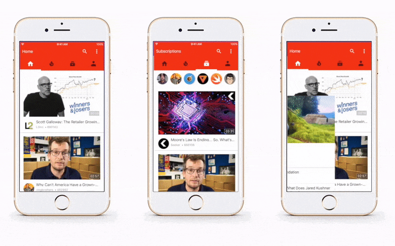

# Youtube iOS Template: No Storyboard Modification

This project is an exercise in converting an iOS app with a complex storyboard into an iOS app without storyboard. 

The project selected for this exercise was the Youtube iOS Template developed by [Haik Aslanyan](https://twitter.com/aslanyanhaik) and written in Swift 3 and can be viewed/downloaded via its repository: [Youtube iOS Template](https://github.com/aslanyanhaik/youtube-iOS)

**Youtube iOS Template** was selected due to its Storyboard with six view controllers and three specialized views.

Programmatic layout of constraints were greatly helped by [LBTA Tools](https://github.com/bhlvoong/LBTATools) by Brian Voong [@buildthatapp](https://twitter.com/buildthatapp) [YouTube](https://www.youtube.com/letsbuildthatapp)

# Youtube iOS Template: Original Readme below

----------------------------------------------------------------------------------------------------------------------------------

Youtube iOS Template is developed by [Haik Aslanyan](https://twitter.com/aslanyanhaik) and written in Swift 3.

Purpose of this repo is to show how ViewControllers can be managed.

<h3 align="center">

</h3>

## Getting Started

All extra views are located in Navigation Controller and Main View Controller in storyboard.
<h3 align="center">

</h3>

## Compatibility

This project is written in Swift 3.0 and requires Xcode 8.2 or newer to build and run.

Youtube iOS Template is compatible with iOS 9.1+.

## Author

* [Haik Aslanyan](https://twitter.com/aslanyanhaik)

## License

Copyright 2017 Haik Aslanyan.

Licensed under MIT License: https://opensource.org/licenses/MIT
